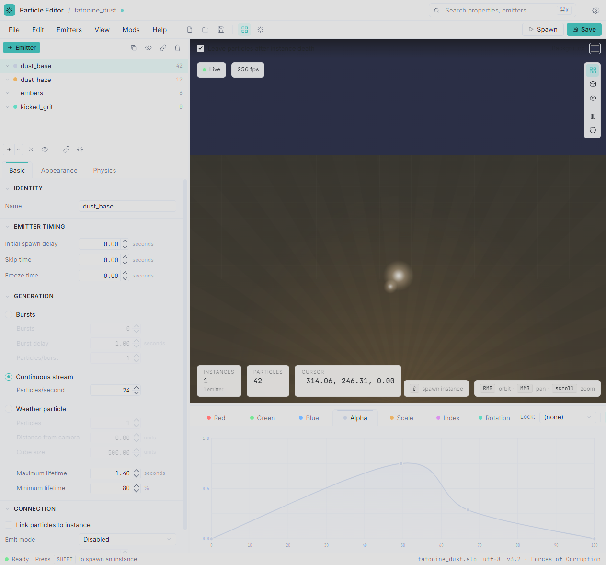

# Roadmap

Planned work for the particle editor, grouped by horizon. Difficulty is rated
on a 1–5 scale; effort is a rough hour estimate for a contributor already
familiar with the codebase (multiply by 2–3× when first ramping up on Win32 +
D3DX9).

Items can land in any order within their tier — the grouping reflects scope
and risk, not strict dependency.

> **Correctness bug backlog.** Roadmap items are features and quality
> investments. Discrete bugs surfaced by audits or reports live in
> [`tasks/post-audit-followups.md`](tasks/post-audit-followups.md) — that
> doc tags each item by branch ([master] / [lt-4] / [both]) and severity
> (P1/P2/P3). Drain the P1s there before pulling fresh roadmap work.

This file is split into six parts:

1. **[Near term](#1-near-term)** — quality-of-life polish on existing workflows. Each item is contained, low risk, and doesn't touch the rendering pipeline or file format.
2. **[Medium term](#2-medium-term)** — bigger UX investments and modest engine work. Each touches more than one subsystem but stays inside the rendering preview / editor surface.
3. **[Long term](#3-long-term)** — larger features that meaningfully expand what the editor can do. Each is roughly on the order of a small project rather than a sitting.
4. **[Notes on prioritization](#4-notes-on-prioritization)** — guidance on which tier to pick from next.
5. **[Shipped](#5-shipped)** — roadmap items that have landed on master. Kept for traceability with PR number, original estimate, and actual effort.
6. **[Notes on roadmap conventions](#6-notes-on-roadmap-conventions)** — how item headings are numbered and tagged, and the renumbering rules that fire when an item ships.

---

## 1. Near term

Quality-of-life polish on existing workflows. Each item is contained, low
risk, and doesn't touch the rendering pipeline or file format.

*No near-term items currently. The [NT-11] soft chain warning shipped
2026-06-10 — see the [NT-11] entry in Shipped §5.*

---

## 2. Medium term

Bigger UX investments and modest engine work. Each touches more than one
subsystem but stays inside the rendering preview / editor surface.

*No medium-term items currently. The [MT-11] architecture-C migration
shipped across Phase 1+2+3 on the `lt-4` branch through May 2026 —
see the [MT-11] entry in Shipped §5.*

---

## 3. Long term

Larger features that meaningfully expand what the editor can do. Each is
roughly on the order of a small project rather than a sitting.

### 3.1 [LT-1] Programmable particle spawner v2
The v1 spawner shipped (see Shipped). v2 fills out the polish and
extra-mile cases that didn't make the first cut:

- **Arc paths** — rotate the spawn point around an axis by a
  configurable angle; useful for orbital / sweep test patterns.
- **Velocity shorthand** — accept magnitude + azimuth + elevation
  alongside raw XYZ, for "100 units/s up at 45°"-style inputs.
- **Path visualization in the preview** — render the spawn position
  (and any path) as a teal marker / line so the user can see where
  emissions originate without guessing in 3D space. Deferred from v1
  because the engine has no simple-line draw helper today.
- **Named presets** — save a config under a name (e.g. "rocket trail",
  "explosion debris"), recall later. Stored as additional REG_BINARY
  blobs `SpawnerPreset_<name>`.
- **Clear-active-spawns button** — explicit "Kill" button for live
  spawner-emitted instances when the user wants to wipe and re-tune
  without waiting for natural decay.

Dropped from the original v2 plan: user-drawn curve paths and
"draw-the-path-in-the-viewport" interactive mode — too much UX
complexity for the value they add.

- **Difficulty**: ★★★☆☆ (3/5)
- **Estimated effort**: 5–9 hours

### 3.2 [LT-2] Template particle systems (starter library)
Ship a curated set of starter `.alo` files (basic fire, smoke column,
explosion, sparks, smoke trail, weather, etc.) under `templates/` next to
the exe. Add a **File → New from Template…** entry that opens a small
dialog with thumbnails or named entries; selecting one loads it as an
unsaved new system that the user can iterate on. Lowers the activation
energy for new mod authors.

- **Difficulty**: ★★★☆☆ (3/5) — most of the work is curating the templates
- **Estimated effort**: 6–10 hours (excluding template authoring time)

### 3.3 [LT-4] UI overhaul (WebView2 + React chrome)
The current UI is faithful to the original 2009-era tool: native Win32
controls, plain GDI rendering, the system color scheme, fixed dialog
layouts that don't reflow. A mockup of a modern design exists in Claude
Designer; this item brings the editor into line with that vision.

*Mockup target: dark theme, Inter / JetBrains Mono webfonts, teal
accent (`#62d4d0`), four-level panel hierarchy, drag-to-scrub number
inputs, an SVG curve editor with channel-coloured tabs, blurred floating
HUD pills over the D3D9 viewport. Light theme and a compact-density
variant are included as toggles in the same design.*

**Implementation path: WebView2-hosted React chrome over the existing
D3D9 engine.** The mockup is implemented in React (Inter / JetBrains
Mono web fonts, dark + light themes via CSS custom properties, density
variants, an SVG curve editor, drag-to-scrub number inputs, blurred
floating HUD pills over the viewport). It deliberately uses CSS features
— `backdrop-filter: blur()`, `color-mix(in oklab, …)`, animations,
focus-within transitions — that don't have native Win32 / GDI
equivalents. Skinning the existing controls would visibly miss the mark;
a full rewrite in Qt or ImGui is a larger lift than necessary.

The right shape is therefore:

- **Keep**: the engine (`engine.cpp`, all of `EmitterInstance` /
  `ParticleSystemInstance`), the `.alo` chunk parser/writer, the
  `FileManager` / `TextureManager` / `ShaderManager` plumbing. None of
  these are coupled to the Win32 UI.
- **Replace**: every dialog, every control, the menu bar, the toolbars,
  the tree view, the property tabs, the curve editor, the track editor,
  and the status bar — the entire chrome — with a WebView2-hosted React
  app.
- **Bridge**: JS ↔ C++ via WebView2's `chrome.webview.postMessage` and
  host objects. Every property field becomes a binding; the C++ side
  exposes the particle-system state as a serializable model the React
  app reads / writes.
- **Viewport**: the D3D9 swap chain stays. Either render into a child
  HWND positioned under a transparent `
` that the JS
  layout sizes, or render into a shared texture the WebView samples.
  Child-HWND-with-clip is simpler; shared-texture composites cleaner if
  the HUD pills want to truly overlay the render.

**Parts of the work, roughly in order:**

1. **WebView2 host scaffolding** — embed the control, load the React
   bundle, wire the message bridge, get one trivial round-trip working
   (e.g. emitter list).
2. **Engine state model** — design a serializable view of
   `ParticleSystem` + `Engine` state that React owns; map every UI edit
   back into mutations on the C++ side without re-creating the engine.
3. **Viewport hosting** — child-HWND positioned by the React layout,
   resized on window/layout changes, handles mouse/keyboard for camera
   and Shift-spawn.
4. **Inspector port** — Basic / Appearance / Physics tabs against the
   live model. The biggest single piece of work; lots of fields.
5. **Tree, menu, toolbars, curve editor, track editor, status bar** —
   each is its own port.
6. **Existing-feature parity** — Mods menu, hot-reload (F5/F6),
   game-path picker, autosave, accelerators, persistence.
7. **Polish** — light/dark toggle, density toggle, font stack selection
   from the mockup's three options, keyboard navigation,
   accessibility.

**Difficulty**: ★★★★★ (5/5)
**Estimated effort**: 80–140 hours assuming React + WebView2 fluency;
significantly more if either is being learned mid-project. Realistically
a multi-week feature branch.

**Risks worth naming up front:**

- **WebView2 runtime distribution.** Bundled in Windows 10+ via the
  Evergreen runtime, but missing on some old / debranded installs. If
  absent, install fallback adds ~150 MB on first run. Acceptable for a
  modding tool but worth noting in release docs.
- **Per-frame state churn.** The current Win32 UI updates lazily; with
  React the temptation is to drive renders from every spinner tick.
  Bridge protocol must be coalescing-friendly or the inspector will
  fight the GPU for scheduling.
- **Modal dialog parity.** WebView2 doesn't natively give you Win32
  modal-dialog semantics (file pickers, native menus). Either keep
  using `GetOpenFileName` / `SHBrowseForFolder` natively and route
  through the bridge, or build their replacements in React. The native
  route is simpler and what most hybrid apps use.
- **Accelerator / focus interactions.** Win32 accelerators (`F5`, `F6`,
  `Ctrl+S`, etc.) need to keep working when focus is inside the
  WebView; this requires a small bit of message-pump plumbing.
- **Branch longevity.** The other roadmap items (autosave, reorder,
  duplicate, etc.) will keep landing on master in the meantime; the UI
  branch needs to stay rebased or those features will need to be
  re-implemented in the new chrome anyway. Worth landing the smaller
  near-term items *first*, so the React port doesn't have to track a
  moving target.

**Path A and Path C alternatives, kept here for completeness:**

- *Skin native controls in place* — owner-draw buttons / tabs / group
  boxes; pick fonts and colors. ~25–40 hours, low risk, but loses the
  mockup's distinctive features (blur, color-mix, animations, density
  modes). Reasonable only if the Designer mockup is later simplified
  into a "modern Win32" target rather than a Web-styled one.
- *Full rewrite in Qt or Dear ImGui* — replaces both the chrome *and*
  the rendering host. ~150–300+ hours. More work for less mockup
  fidelity than Path B; worth considering only if WebView2 turns out
  not to be acceptable for some other reason.

---

## 4. Notes on prioritization

The near-term tier is intentionally chosen so each item can land in a single
short PR with low blast radius — these are the things to pick up between
larger projects.

The medium-term tier mostly adds **environment fidelity** (textures,
skydomes, lighting) so the preview matches in-game rendering more
faithfully. Worth doing before the long-term tier because programmable
spawning and template authoring both benefit from a representative preview.

The long-term tier is where the editor stops being a faithful clone of the
original tool and starts being a genuinely better one. Programmable spawning
is the one with the highest leverage on the iteration loop; the **UI
overhaul** is the largest item in scope and probably wants to land on a
long-lived branch that other work can be rebased onto rather than blocking
the rest of the roadmap.

---

## 5. Shipped

Roadmap items that have landed on master. Kept here for traceability —
PR number, original estimate, and actual effort, so future estimates can
calibrate against history. New shipped items go at the top and take
position `5.1`; the rest shift down. Entries shipped before this
convention have no bracketed `[TIER-K]` tag; they're referenced by PR
number.

### 5.1 [NT-11] ~~Soft warning when an emitter chain's particle multiplication explodes~~ ✅ Shipped (#TODO)

*Estimate: ★★ (2/5), ~2-4 hours.*
*Actual: ~4 hours (design conversation + 8-task subagent-driven build; the
estimate held).*

An advisory amber ⚠ on every emitter-tree row of a chain whose estimated
alive-particle count exceeds 10,000 (Little's law per emitter, product down
the chain), with a per-generation breakdown tooltip. Never blocks — the
warning exists so a v1-style particle bomb can't reach a save unnoticed.
Host + mock surface the six spawn params on the tree DTO; the estimator is
one pure web-side function (`web/apps/editor/src/lib/chain-load.ts`).
Design spec: `docs/superpowers/specs/2026-06-10-chain-warning-design.md`.

### 5.2 [NT-10] ~~Further reduce maximized save-modal backdrop snapshot latency~~ ✅ Shipped (#101)

*Estimate: small.*
*Actual: ~1 session. Avenue (a) (`StretchRect` into a small RT) shipped as planned, but profiling the real 3440×1369 device showed the readback was never the bottleneck — the GDI+ PNG encode + base64/IPC of a ~905 KB PNG was (~50 ms of a ~72 ms total). So the fix is two complementary cuts in `CaptureSnapshotPng`: (1) a GPU `StretchRect` fast path that crops+downscales `offscreenRT` into a small `CreateRenderTarget` surface and reads back THAT (readback ~8 ms → ~1.5 ms, decoupled from window size; the ~19 MB memcpy + GDI+ `DrawImage` gone); (2) encoding the (blurred) backdrop as JPEG q82 instead of PNG (encode ~28 ms → ~1.7 ms, payload 905 KB → ~120 KB, which also slashes the base64/IPC/browser-decode transit). Maximized `[INSTANT-MODAL]` ~72 ms → ~6 ms (~11×). Three D3D9 preconditions a naïve `StretchRect` would miss — caught by a first-party-docs verification + an adversarial red-team, then guarded: the source is the engine's currently-bound slot-0 RT (`StretchRect` from the active RT can return `D3DERR_INVALIDCALL`, so slot 0 is parked on the swap-chain back buffer for the blit), it is an RT *texture* (needs `DevCaps2 & CAN_STRETCHRECT_FROM_TEXTURES`), and `LINEAR` needs `StretchRectFilterCaps`. Any cap miss or runtime failure falls back to the original full-readback path (zero regression, verified by forcing the slow path through the 174-test native harness). Avenue (a) alone was ~27%; JPEG was the actual lever.*

The frosted-glass modal backdrop captured by `AlphaCompositor::CaptureSnapshotPng` now appears effectively instantly even when the editor is maximized (**~6 ms** vs the prior **~72 ms**). The capture crops + downscales on the GPU via `StretchRect` and encodes a small JPEG — shown blurred under `Dialog.Overlay`'s `backdrop-blur-sm`, so lossy is invisible. The `viewport/capture-snapshot` response field is now `imageBase64` (was `pngBase64`); the `--capture` offline-diff path (`CaptureSnapshotToFile`) stays full-resolution PNG. Avenues (b) async-encode and (c) warm cache from the original triage were not needed.

### 5.3 [MT-12] ~~Flip default to architecture C + retire env-var dual-toggle~~ ✅ Shipped (#92)

*Estimate: ★★★ (3/5), ~3-5 hours.*
*Actual: ~4 hours, single dispatch on session branch `claude/mt12-flip-default-archc`. Tactical conditional inversion at two parallel sites (C++ host at `HostWindow.cpp:520-575` + React at `ViewportSlot.tsx:29-77`) plus a test-harness flip (`run-native-tests.mjs` adds `--legacy`; `package.json` adds `test:native:legacy` / `a11y:legacy` / `a11y:update:legacy` scripts) and a spec mode-gate migration across 17 spec files (`process.env.ALO_WEBVIEW2_HOSTING === "composition"` → `process.env.ALO_HOSTING_MODE !== "legacy"`). Two pre-MT-12 ViewportSlot vitest tests asserting an unreachable intermediate state (canvas-jpeg without composition) collapsed into a single positive assertion that default mode skips the frame-ready subscription; net vitest count 348 → 347. Mode-consistency banner deferred to a follow-up per R2 scope-trim — log-only diagnosis (`[host] hosting mode:` + `[mode] React build mode:`) is enough for the self-evident broken-viewport symptom. Architecture A code paths intentionally preserved per user requirement ("only delete A once C is confirmed stable") — filed as future architecture-A-deletion dispatch in HANDOFF "Known follow-ups" item 11.*

Default editor launch is architecture C: cold `ParticleEditor.exe --new-ui` boots into DXGI composition + DComp engine visual + WebView2 composition hosting, no env vars required, no special build. Architecture A (legacy AlphaCompositor popup + HWND-hosted WebView2 + JPEG decode into ``) is opt-in via a single `ALO_HOSTING_MODE=legacy` runtime env var + a matching `VITE_HOSTING_MODE=legacy` build-time bake. The four pre-MT-12 env vars (`ALO_WEBVIEW2_HOSTING` + `ALO_VIEWPORT_TRANSPORT` + their VITE_* twins) are retired — the host emits a loud deprecation warning at startup if any is still set in the environment, naming the migration path. Boot-time log lines on both runtime (`[host] hosting mode: ...`) and React build (`[mode] React build mode: ...`) bracket the active mode so issue reports include it in their first log line. Test-harness default profile flipped to match: `pnpm test:native` runs the composition lane (`~157 / 0 / 31`), new `pnpm test:native:legacy` runs the legacy HWND lane (`~132 / 0 / 56`). HANDOFF "How to run modes locally" section inverts the dance — composition is now default; the env-var path is for the legacy opt-out. The follow-on "delete architecture A" is queued as a future dispatch contingent on default-mode stability confirmation in daily use.

### 5.4 [MT-11] ~~Migrate engine rendering to DOM `<canvas>` (architecture C)~~ ✅ Shipped (#92)

*Estimate: medium (~16-32 h post-spike).*
*Actual: spans Apr–May 2026 across the `lt-4` integration branch, executed as Phase 1 (D3D9Ex + shared-handle infrastructure) → Phase 2 (canvas-jpeg viewport transport behind `ALO_VIEWPORT_TRANSPORT=canvas-jpeg`) → Phase 3 (WebView2 composition hosting via `ALO_WEBVIEW2_HOSTING=composition`, Stages 0–5 + a11y close-out). Total scope vastly exceeded the medium-tier estimate — the migration touched the engine's device-creation path, AlphaCompositor's render-target topology, a new DXGI bridge (engine pixels reach screen via shared D3D9 texture → D3D11 alias → DXGI composition swapchain → DComp engine visual), a per-pixel-FoV scene-rect transform (variant B-γ — chrome panels no longer bleed engine pixels and pane/window resize cleanly reveals more scene), and a dual-mode Playwright a11y regression gate (HWND Win32 UIA + composition DOM snapshot, ~58 committed goldens across ~29 surfaces × 2 modes). Phase 0's a11y cross-mode spike initially read composition-mode UIA as zero-descendant; T9.3 discovered `--force-renderer-accessibility` + a `GetFocusedElement` warmup makes the React tree reachable via Win32 UIA at depth 20 — the dual-API design was kept (DOM snapshot is faster + more stable) but T11 was re-shaped from negative-contract into positive backbone-reachability. Six lessons.md entries surfaced (L-016 MSDN AddVisual naming inversion, L-017 DXGI ALPHA_MODE_IGNORE vs PREMULTIPLIED for legacy engines, L-018 verify-before-acting, L-019 DXSDK linker-twin, L-020 spike-config-vs-production audit, L-021 verify rendered geometry, L-022 handoff-claim verification, L-023 MSBuild `$(SolutionDir)`, L-024 UIA non-determinism: source-side fix vs normalizer concept).*

Engine pixels now reach screen via a WebView2-hosted DComp visual instead of the legacy top-level layered popup. Under default new-UI mode the editor still uses architecture A (visible AlphaCompositor popup with UpdateLayeredWindow + per-frame band-mask occlusion driven by React's `layout/scene-rect`), but the architecture-C pipeline is wired end-to-end behind `ALO_WEBVIEW2_HOSTING=composition` + `ALO_VIEWPORT_TRANSPORT=canvas-jpeg` and verified by Playwright's `dxgi-transport.spec.ts` + sibling specs. Under composition mode the engine renders to its D3D9Ex shared-handle texture; AlphaCompositor stays the engine's RT origin; a parallel D3D11 device opens the shared handle, the DXGI composition swapchain carries the pixels to a DComp engine visual inserted behind the WebView2 visual, and a scene-rect transform (variant B-γ, per-pixel-FoV) clips the engine visual to the centre quadrant on screen + scopes the engine's viewport / projection to the same rect — chrome panel backgrounds become visible (no more popup overlay) and pane/window resize reveals more world content at the widened edges without distortion. Phase 3 also added the dual-API a11y regression gate (HWND Win32 UIA via standalone `uia_inspector.cpp` C++ exe + composition `page.accessibility.snapshot()` over CDP) covering ~29 interactive surfaces in each mode, the `a11y-uia-composition-reachable.spec.ts` backbone-reachability contract, Stage 3i manual checklist + Narrator-speech recording. LT-4's UI overhaul (the umbrella) continues; this entry closes the MT-11 piece (engine rendering migration + a11y acceptance hygiene). Many PRs landed across Phase 1/2/3; the close-out PR is the FF of `lt-4` after this docs commit.

### 5.5 [NT-8] ~~Resizable splitters for left / centre / right column boundaries~~ ✅ Shipped (#92)

*Estimate: small.*
*Actual: ~6 hours across two sessions. Session 1 (T0–T5, 5 commits) installed `react-resizable-panels@4.11.1` and built the `PanelLayout` component with four drag handles (left↔centre, centre↔spawner, viewport↔curve, tree↔tabs). Persistence is DIY in 4.x — `autoSaveId` was removed in the major rewrite — so a small `usePersistedLayout(key, defaults)` hook reads/writes the four `alo:layout:*` keys with defensive parse + ratio validation. Session 2 (T4b → T4c.5 + T6, 7 commits) hit a regression where the engine viewport popup overlapped panels mid-drag because per-frame `Engine::Reset` stacked under the splitter's ResizeObserver bursts. A first fix attempt (T4b) parked the popup offscreen during drag via pointerdown/pointerup capture; the timing was structurally unreliable (Win32 layout commits arrive after React's synchronous pointerup handler reads the post-drag rect) and reverted. The architectural redirect (T4c) keeps the popup HWND sized to the main client area at all times and dispatches a per-frame `layout/scene-rect` that drives an `AlphaCompositor` band mask outside the centre quadrant — splitter drag now updates an alpha mask, not a device Reset. T4c.5 cropped the modal-snapshot PNG to the scene rect (post-T4c the popup spans the main row, so encoding the full DIB stretched outside-scene pixels into the centre quadrant's ``). T6 added the View → Reset panel layout menu item (clears the four `alo:layout:*` keys + bumps an epoch counter that remounts `PanelLayout` with defaults). 4.x quirks recorded as `tasks/lessons.md` L-014: numeric `Panel.defaultSize` props are PIXELS not percentages (use `"NN%"` strings); `Group.defaultLayout` is an SSR-hydration hint only, `Panel.defaultSize` is the canonical client knob.*

Drag any of four boundaries in the editor shell — left column ↔ centre column, centre column ↔ Spawner column (when Spawner is visible), viewport ↔ curve editor, and emitter tree ↔ property tabs — and the new sizes survive a page reload via `localStorage`. Min/max constraints per pane (e.g. left column clamped between 15 % and 40 % of window width) prevent dragging any pane to unusable widths. The handles ship full keyboard a11y from the library (arrow keys nudge, double-click resets the splitter's two panels to their default size). Spawner toggle uses two separate persistence keys (`alo:layout:outer:2col` / `:3col`) so the 2-column and 3-column states keep independent ratios. A new **View → Reset panel layout** menu item clears all four keys and remounts the layout at the in-code defaults (20/60/20 outer 3-col, 25/75 left, 75/25 centre). No bridge schema changes; no C++ touched (the engine popup's existing `ResizeObserver`-driven scene-rect dispatch picks up splitter drags for free through `AlphaCompositor`'s band-mask path). 12 commits + this docs commit. Replaces the previous fixed-width column layout that had been the structural skeleton since B1.

### 5.6 [NT-9] ~~Frosted-glass modal backdrop via engine-snapshot capture~~ ✅ Shipped (#92)

*Estimate: small.*
*Actual: ~3 hours, 4 commits (snapshot bridge surface squashed with the dispatcher handler + Modal rewiring + smoke-test polish + modal-mask cleanup) plus docs. Two smoke-test rounds caught structural issues that reshaped the implementation: the first surfaced opaque engine pixels leaking outside the modal occlude during a drag-resize (root cause: the Win32 modal sizing loop on the host thread runs WM_SIZING / WM_SIZE inside a sub-pump that calls `LayoutBroker::PredictAndApply` synchronously but does NOT pump WebView2 IPC, so renderer→host bridge messages can't land during the drag); the second surfaced visible stutter caused by per-frame GDI+ PNG re-encodes during the same drag. Both fixed by host-state-durable design: the React Modal sends ONE occlude with a deliberately-enormous sentinel rect (-1e5, -1e5, 2e5, 2e5) that `ApplyOcclusion` clips to the current popup bounds regardless of resize timing, and ONE capture on modal open with no re-capture during the modal's lifetime (the snapshot img scales via CSS, and the dim+blur in `Dialog.Overlay` hides any content staleness). Captured as L-013 in lessons.md.*

Engine viewport pixels are captured to a base64-encoded PNG by `AlphaCompositor::CaptureSnapshotPng` (Gdiplus zero-copy Bitmap ctor over the cached pre-stamp DIB → PNG-encoded into an in-memory IStream → 30-line inline base64). React Modal portals the snapshot as an `` into the viewport-quadrant DOM, then full-alpha-cuts the engine popup so `Dialog.Overlay`'s `bg-black/60 backdrop-blur-sm` blurs panels + snapshot uniformly — no visible popup boundary because both sides of it are now WebView2-rendered. Replaces the modal-mask server-side compositor pipeline that B1.3.1 polish round 9 landed as interim work (deleted in P6: `SetModalMask`, `BoxBlurDibBgra`, `MultiplyDibAlphaBgra`, `FadePopupEdges`, `Smoothstep01Edge`, the `viewport/set-modal-mask` bridge surface — replaced by `viewport/capture-snapshot`). The new `` approach has a clean architectural property: CSS effects can sample the snapshot natively because it lives in the WebView2 DOM tree, sidestepping the cross-layer compositing limit that defeated the modal-mask approach (L-011).

### 5.7 [NT-7] ~~Inspector layout follow-ups — tabs always visible + tab strip height + emitter list flex-grow~~ ✅ Shipped (#92)

*Estimate: small.*
*Actual: ~1 hour, 4 commits (plan + bundled implementation + docs + a post-smoke-test polish round). Two architectural decisions confirmed up-front via a question chip (initially 50/50 over biased ratios; free tab clicking over disabled-when-no-selection); the polish round bumped the default to 25/75 favouring tabs after the user smoke-tested the build, matching the "tab strip dominates the visual hierarchy" brief.*

Single bundled implementation commit covering all three findings the user deferred from B1.3's smoke test: (1) tab strip always visible — Tabs.Root + Tabs.List lifted out of the early-return, with a body-level placeholder via a `renderBody((p) => …)` helper inside each Tabs.Content; (2) tabs slot flexes alongside the EmitterTree on the panel-body axis — `h-72 shrink-0` → `flex-[3_1_0%] min-h-0` on the lower-left slot in App.tsx (tree stays `flex-1`); (3) tree breathes into the space the fixed slice used to claim — falls out of the flex change since the tree was already `flex-1 min-h-0`. Default split lands at **25/75 favouring tabs**. Placeholder testid + copy preserved verbatim per L-010; two existing vitest waitFor patterns retuned from the now-too-eager `getByTestId("emitter-property-tabs")` to `getByLabelText("Maximum lifetime:")`. No bridge schema, no C++.

### 5.8 [NT-5] ~~Engine-side single-member link-group enforcement~~ ✅ Shipped (#92)

> **Shipped on `lt-4`** — `BridgeDispatcher::EnforceSingleMemberLinkGroups()`
> ([src/host/BridgeDispatcher.cpp:4305](src/host/BridgeDispatcher.cpp:4305)) wired into
> `emitters/delete`, `linkGroups/set-membership`, and file-open bind; contract test at
> `emitter-mutations.spec.ts` ("NT-5: leaving a 2-member link group demotes the
> survivor"). Developed on `lt-4` (`5d4a9ba`, 2026-05-25); landed on `master`
> via the LT-4→master supersede (PR [#92](https://github.com/DrKnickers/new-particle-editor/pull/92),
> `f05fa36`). Relocated into §5 from Near-term in this pass (the previously
> deferred cosmetic tidy noted alongside NT-6) — the position numbers are
> purely visual. The `[NT-5]` tag is retired.

*Estimate: small.*

Three C++ mutation paths can leave a link group with exactly one
member: `linkGroups/set-membership` (when leaving a 2-member group
OR joining a different one that shrinks the previous group),
`emitters/delete` (when one of a 2-member group's members is
deleted), and `linkGroups/set-membership` with `groupId: -1` and
a single-id input list (creating a new group with one member).

Each path should auto-demote orphaned members to `linkGroup = 0`
before the operation returns. B1 ships a render-layer filter
(in `computeLinkGroupBrackets`) that hides single-member groups
from the gutter — but the data layer still carries them, so the
Inspector's "Link Group: N" field on an orphaned emitter reads
honestly-but-confusingly.

Engine enforcement makes the data layer match the rendered view
end-to-end. Touches `BridgeDispatcher::DispatchRequest`'s three
named handlers + the corresponding mock cases + their playwright
contract specs.

### 5.9 [NT-6] ~~Visual-stability lane assignment for bracket gutter~~ ✅ Shipped (#92)

> **Shipped on `lt-4`** — `computeLinkGroupBrackets`' greedy first-fit lane
> assignment ([link-group-colors.ts](web/apps/editor/src/lib/link-group-colors.ts))
> is replaced by one **dedicated lane per group**, stable by `groupId`. This is
> stronger than the originally-sketched `(groupId - 1) % maxLanes` — no modulus
> collisions; the gutter simply widens with the group count. Landed in the same
> pass as two non-roadmap bracket-polish items (per-member stubs + name-hugging
> brackets). Tests in `link-group-colors.test.ts`. Developed on `lt-4`
> (`44f9e81`, 2026-06-02); landed on `master` via the LT-4→master supersede
> (PR [#92](https://github.com/DrKnickers/new-particle-editor/pull/92), `f05fa36`).
> Relocated into §5 from Near-term in this pass (the previously deferred
> cosmetic tidy, per the NT-5 note above). The `[NT-6]` tag is retired.
>
> *Actual: small (~1 sitting, bundled with the stub + name-hug work).*

*Estimate: small.*

B1's multi-lane gutter uses greedy first-fit (aggressive reuse)
for lane assignment. A bracket's `lane` field can change between
renders when surrounding groups change — semantically OK (the
bracket's colour identifies the group; lane is just an x-offset),
but visually a bouncing gutter may annoy daily users with many
link groups.

Add a setting that opts the user into stability-by-groupId:
`lane = (groupId - 1) % maxLanes`. Same group always lands in
the same lane. Modest collision risk between groups whose IDs
share a modulus — rare in practice.

Only worth doing if real use reveals the bouncing as a real
ergonomic issue.

### 5.10 [LT-3] ~~Import emitters from other particle files~~ ✅ Shipped (#77)

New **File → Import Emitters from File…** entry opens an `.alo` picker and a modal dialog showing the source file's emitter tree with `TVS_CHECKBOXES`. Tick whichever emitters you want — *Auto-include children* is on by default so ticking a parent picks up its descendants — hit OK, and the selected emitters land as new root emitters in the current particle system. *Select all* / *Clear* / *Browse…* buttons round out the dialog; *Browse…* swaps the source file in place without cancelling. OK is disabled until at least one emitter is ticked.

**Cross-reference handling**: spawn-field indices get re-mapped where both source and child were imported (`spawnDuringLife` / `spawnOnDeath` rewritten to the destination index), dropped to `-1` where the source child wasn't imported. Source link groups with ≥2 imported members are re-created as fresh destination groups via `CreateLinkGroup`; single-member buckets arrive unlinked. Imported emitters arrive with collision-free names (e.g. `smoke_1`) via the existing `GenerateDuplicateName` rule. The entire import is one undo step — Ctrl+Z atomically rolls back every newly-added emitter.

**Out of scope (v1)**: importing into a destination-parent slot (imports become roots, user re-parents via drag-and-drop), preview thumbnails in the picker tree (names + tree shape only), multi-file selection (one source per dialog), `.alo` files inside mod `.meg` archives (OS file system only).

**Implementation**: round-trip clone via existing `Emitter::write(writer, copy=true)` + `Emitter(ChunkReader&)` through a `MemoryFile` buffer — no new serialiser; the field-level logic stays in one place. Three-pass import engine in [`src/main.cpp`](src/main.cpp): Pass 1 clones + records `src_idx → dst_idx`; Pass 2 rewrites spawn fields via the map and rebuilds parent pointers; Pass 3 re-creates source link groups in destination. Dialog uses `TVS_CHECKBOXES` TreeView with portable `NM_CLICK` + hit-test + `PostMessage(WM_APP+1)` for the cascade (no SDK-version sniffing).

- **Difficulty**: ★★★★☆ (4/5)
- **Estimated effort**: 8–14 hours
- **Actual**: ~6 hours including the plan + risk pass + the menu-rebuild-eats-static-entry detour. Drove directly without `subagent-driven-development` — the feature scope was small enough that a single focused plan + per-pass implementation was the right cadence.

### 5.11 [MT-3] ~~Selectable skydome backgrounds via the unified Background button~~ ✅ Shipped (#73)

The toolbar's existing **Background:** colour button is now the single entry point for all background settings. Click it to open a modeless **Background** picker dialog — a 12-slot icon-mode `SysListView32` laid out as a 4×3 grid of 192×192 thumbnails. Slot 0 is **Solid colour** (click to open the standard Win32 colour picker); slots 1–8 are bundled scenes (Space / Atmosphere / Sunset / Dawn / Night / Overcast / Studio / Indoor); slots 9–11 are user-customisable. The toolbar preview itself is a hybrid 24×24 button: a flat colour swatch when the picker's slot 0 is active, a skydome thumbnail otherwise. There is no longer a separate standalone skydome preview button — the unified Background button covers both modes.

**Interactions** mirror the MT-1 palette popup's *sticky* model rather than MT-2's *click-closes* model: clicking a slot commits the selection but the dialog stays visible so you can browse other backgrounds interactively. Close via the title-bar X or by toggling the Background button. Empty Custom slots single-click into `GetOpenFileName` filtered to `*.dds;*.tga` (EaW's native texture formats — point at game environment textures directly with zero conversion); right-click a Custom slot for *Set custom skydome…* / *Change skydome…* / *Clear slot*; the dialog's *Reset custom slots* button at the bottom wipes only the user-supplied paths after a confirmation prompt. Clicking slot 0 (Solid colour) opens `ChooseColor`; cancelling out still commits "skydome off" so the existing background colour is preserved. View → Reset View Settings returns the active slot to *Solid colour* and clears `SkydomePickerPos` but deliberately preserves the three `SkydomeCustomSlot*` registry values (same "slot assignments are user data, not view settings" convention as MT-2).

**Render integration** is a single new pass between the existing `D3DDevice9::Clear` and the ground-plane render. The skydome is a hand-rolled 32×16 UV sphere (561 vertices / 1024 triangles, `D3DPOOL_MANAGED`) rendered with `Translation(camera.Position)` as the world matrix — the sphere stays "infinite" while the camera orbits the world origin where the particles live. State during the pass: depth-test off, depth-write off, cull-CW (we view the sphere from inside). The shader (`Engine\Skydome.fx`, vs_2_0 / ps_2_0) does standard equirectangular sampling (`tex2D` on the (U, V) the mesh carries) and pushes z to ~1.0 in NDC for belt-and-suspenders far-plane behaviour. The previously-dangling `Engine::SetShadow` neighbour from MT-4 is unaffected; the new code touches only `Engine::Render`'s clear/ground transition and adds a sibling family of `m_pSkydome*` members.

**Persistence**: 5 `HKCU\Software\AloParticleEditor` values — `SkydomeIndex` (DWORD, slot 0..11), `SkydomeCustomSlot{9,10,11}` (REG_SZ, custom paths), and `SkydomePickerPos` (REG_BINARY RECT). The existing `BackgroundColor` (DWORD) and `CustomColors` (REG_BINARY, the ChooseColor 16-slot palette) keys are unchanged — switching to a skydome and back naturally preserves whatever solid colour was last in use. Bundled defaults restore on a fresh install; an out-of-range or missing-file path falls back to slot 0 (Solid colour) rather than crashing.

**Assets**: slots 1–8 resolve curated base-game textures via the existing `FileManager` chain (`DATA\ART\TEXTURES\W_SKY*.DDS`), so the active mod's overlay applies automatically the same way emitter textures pick up mod overrides. When `FileManager` can't resolve a slot's path (no base game installed, mod doesn't ship the file), the slot falls back to the procedural-gradient TGA placeholder bundled as `RCDATA` so the slot still renders something. The procedural placeholders ship at 1024×512 each (~12 MB total `RCDATA`); the engine loader (`D3DXCreateTextureFromFileInMemory`) handles both `.dds` and `.tga` identically. Done in the follow-up MT-3 PR that also rotated the sphere to Z-up poles and routed custom slots 9–11 through `FileManager` first so in-archive paths resolve from the mod / base-game MEGs.

**Win11 GUI quirk avoided**: the spinner read-only rendering issue from MT-4 doesn't recur here — the picker uses the same ListView + WM_PAINT-subclass pattern MT-2 established (where MT-2 had to escape the native ListView's selection-chrome leakage; the picker reuses that subclass verbatim so the 12 cells render cleanly without native blue selection borders bleeding through).

- **Difficulty**: ★★★★☆ (4/5)
- **Estimated effort**: 8–14 hours
- **Actual**: ~10 hours across two stages on the same branch — Stage 1 (~7h, 16 commits) built the engine pass + standalone skydome preview + picker dialog via the `subagent-driven-development` skill; Stage 2 (~3h) reworked the toolbar surface into the unified Background button, deleted the standalone skydome button, added the slot-0 `BackgroundPicker_PickSolidColor` helper, and switched the picker to sticky-on-commit behaviour.

### 5.12 [MT-4] ~~Adjustable environment lighting in the preview~~ ✅ Shipped (#71)

A new **View → Lighting…** modeless dialog exposes the engine's three directional lights (Sun + Fill 1 + Fill 2) and the scene-global ambient and shadow colours. Layout emulates the Petroglyph map editor's Sun / Fill panel — Sun gets Intensity, Z Angle, Tilt Angle, plus Ambient / Specular / Diffuse / Shadow ColorButtons; each Fill gets Intensity, Z Angle, Tilt Angle, and a single Diffuse ColorButton. Two binding controls live in the Sun group: **Force Fill Light Alignment** (default on — drives Fill 1 Z = Sun Z + 120°, Fill 2 Z = Sun Z + 210°, both Tilts fixed at −10°; greys out the fill-angle spinners and the Mirror Sun button) and **Mirror Sun** (one-shot copy of the Sun's Diffuse colour to both Fills). A **Reset to defaults** button at the bottom restores everything to the canonical map-editor values after a confirmation prompt.

Defaults match the Petroglyph map editor exactly: Sun intensity 0.50 / Z 0° / Tilt 45°, Ambient `RGB(40,40,50)`, Specular `RGB(190,190,200)`, Diffuse `RGB(180,180,190)`, Shadow `RGB(100,100,110)`; Fill 1 / Fill 2 intensity 0.50 with slate-blue diffuse `RGB(60,80,160)`. **This is a visible change from pre-MT-4 behaviour** — the editor previously opened with the engine's hardcoded "white sun along +X, no fills, black ambient" defaults. Fresh launches after this PR look noticeably softer and more in line with how an effect actually renders in-game.

Persistence uses 17 new values under `HKCU\Software\AloParticleEditor` (one per spinner + colour picker, plus the Force-align bool and the dialog position). The dialog reads from the registry on every open; engine state is written through on every control change. When Force Fill Light Alignment is on, the dialog *does not* write the fill Z/Tilt registry keys — those hold the user's last free-edit values, restored when alignment is unchecked. Reset View Settings wipes the 17 lighting keys alongside the existing background / ground / bloom keys; its confirm prompt now mentions lighting explicitly.

**Shadow colour is captured but does not currently render**: the engine's `SetShadow` declaration has lived in [src/engine.h](src/engine.h) since the codebase shipped but had no body, and no shader effect handle binds the value. MT-4 implements `SetShadow` as a store-only stub (`m_shadow` member) and the picker round-trips correctly, but the preview won't visibly change when adjusting shadow colour. The control is included for parity with the map editor and forward-compatibility with future shader work.

Side-quests in the same PR:

- **`Spinner_SetReadOnly` API** ([src/UI/Spinner.cpp](src/UI/Spinner.cpp)). The "this fill light's angle is auto-computed" state needed to read as disabled without going through `EnableWindow(FALSE)` — on Win11 themes that path suppresses the EDIT's text entirely, so the spinner ends up looking empty rather than greyed. New API short-circuits the up/down buttons, mouse wheel, arrow-key increments, and EN_UPDATE model writes; paints the up/down arrows with `DFCS_INACTIVE`; and the EDIT's `WM_PAINT` is intercepted (when the spinner is read-only) to draw the value manually in `RGB(60,60,60)` text on `RGB(232,232,232)` background. Returning a brush from `WM_CTLCOLOREDIT` was attempted first but had the same Win11 invisible-text failure mode as `EnableWindow(FALSE)`; the manual paint sidesteps the themed-control draw path entirely.

- **Taskbar icon plumbing**. The main window was using `LoadIcon` (always returns the 32×32 system size) plus `wcx.hIconSm = NULL`, relying on Windows to downscale for the small slot. On Win11 themes that downscale can fall back to the generic "plain window" glyph. MT-4 switches to `LoadImage(IMAGE_ICON, 32, 32)` + `LoadImage(IMAGE_ICON, 16, 16)` with a `LoadIcon` fallback, caches the two HICONs in locals (so the second `RegisterClassEx` for the renderer class can't clobber them via the shared `wcx`), and calls `WM_SETICON`/`SetClassLongPtr` explicitly on the main window after `CreateWindow`. A `SetCurrentProcessExplicitAppUserModelID(L"DrKnickers.AloParticleEditor")` (loaded dynamically out of shell32 so the project's `_WIN32_WINNT = 0x0501` doesn't need bumping) gives the editor a stable taskbar identity that survives moving / renaming the .exe.

- **Pre-existing `ROADMAP.md` duplicate**. The Shipped section had two entries at position 5.15 (Programmable spawner v1 + Buttons to reorder emitters). Closed the gap during this ship's renumber.

- **Difficulty**: ★★★☆☆ (3/5)
- **Estimated effort**: 4–6 hours
- **Actual**: ~6 hours. Core implementation (engine getters, dialog template, registry I/O, `LightingDlgProc`, force-align math) landed quickly; the bulk of the iteration was on the read-only spinner UX (one false start through `WM_CTLCOLOREDIT`, then the `WM_PAINT` subclass) and the taskbar-icon fix.

### 5.13 [MT-1] ~~Frequently-used textures palette~~ ✅ Shipped (#69)

A new palette popup, opened by a small painter's-palette button in the Textures groupbox header on the Appearance tab, surfaces the textures the user has recently picked or explicitly pinned — per mod — as 140×160 thumbnail cells (thumb + filename strip). Double-click a thumb to apply it to the slot indicated by the Color/Bump filter toggle; the popup closes after a commit so the viewport is unobscured. Hovering a cell reveals a thumbtack badge in the top-right; clicking it pins the entry into the Pinned section (separate from Recent, capped at 8 each, status strip surfaces "Pins full" when overflow is attempted). Recents auto-track every successful texture load — file-picker pick, palette double-click, and `EN_KILLFOCUS` on the edit fields (debounced so typing doesn't pollute Recent with intermediate filename fragments).

Per-mod state lives in `%APPDATA%\AloParticleEditor\texture-palettes.ini`, keyed by SHA-1-ish (actually CRC32) of the mod path so arbitrary drive letters / UNC / spaces / non-ASCII characters don't break INI parsing. Popup position persists in a separate `[ui]` section so the user's preferred window placement survives mod switches. Reset View Settings wipes the active mod's entries only; other mods' palettes are preserved.

Window-level: modeless, owned by the main editor window so it dies cleanly with the app. `WS_EX_TOOLWINDOW` gives it the slim chrome / no taskbar entry. Off-screen positions snap to a button-anchored default via `MonitorFromPoint` validation. Esc / title-bar X both hide (sticky model — no auto-close on outside click). The toolbar palette button is `BS_AUTOCHECKBOX | BS_PUSHLIKE` so it visually mirrors the popup's open/closed state regardless of which path triggered the hide.

**Visual**: 4 columns × 2 sub-rows per section × 2 sections (Pinned / Recent) × 2 filters (Color / Bump). Cells are custom-drawn (`AloPaletteContent` window class) with a blue (RGB 160,200,250) hover background, a 3 px lighter-blue hover frame, and a 2 px saturated-blue selection frame. Filename strip uses dialog font + `DT_END_ELLIPSIS`. Whole popup is double-buffered.

**Thumbnail pipeline**: D3DX9 decodes textures via `D3DXCreateTextureFromFileInMemoryEx` at 32×32 (visually upscaled to thumb size on the GDI side), pixels copied to a `CreateDIBSection` HBITMAP, cached in-memory keyed by absolute path. Failed decodes get a magenta-with-X placeholder; missing files get a greyed-out variant. Cache is wiped on mod switch so per-mod identically-named files don't share a stale thumbnail.

**Testing**: a black-box test exe (`tests/test_palette_store.cpp`, 83 assertions across 17 scenarios) backs up the user's real INI, exercises the data layer (mod switch isolation, pin overflow, recents eviction, case-insensitive mod paths, malformed-filename rejection, per-mod filter persistence, popup position round-trip), then restores the INI. Caught one real bug on first run: `SetActiveMod("")` was wiping the previous mod's section instead of just deactivating — fixed.

**MT-2 polish in the same PR**: the ground-texture picker now matches this popup's visual + behavioural model — modeless tool-window with position memory, full custom-paint via `WM_PAINT` subclass (CDRF_SKIPDEFAULT alone couldn't suppress the native ListView selection chrome), blue hover/selection frames identical to the palette's, single-click commit + close, no border around the cell tray.

**CLAUDE.md** picks up a new *Pre-handoff testing* subsection codifying the rigor expected before asking the user to verify a build (build the binary yourself, walk every code path mentally, verify rendered geometry, document the test pass in the handoff message).

- **Difficulty**: ★★★☆☆ (3/5) — original estimate. Visual + behavioural iteration with the user ended up dominating the effort.
- **Estimated effort**: 5–8 hours
- **Actual**: ~25 hours across 35 commits. The data layer + initial popup landed quickly; the bulk of the time was iterating on visuals (hover state, pin badge bitmap, cell sizing, popup geometry) and then porting the same visual model into the ground-texture picker, which required a ListView WM_PAINT subclass to fully escape native paint interference. The pre-handoff testing principle was carved out of this iteration cycle.

### 5.14 [MT-2] ~~Selectable ground texture~~ ✅ Shipped (#67)

The preview's ground plane is no longer hardcoded to `dirt.bmp`. A new **`Ground Texture:`** label + 24×24 owner-drawn preview button in the top toolbar shows the currently-selected texture as a thumbnail; clicking it opens a modal **Ground Texture** picker with a 4×2 grid of slot thumbnails (each 64×64). Bundled defaults are **Dirt** (preserved from pre-MT-2), **Grass** / **Sand** / **Snow** (vanilla EaW textures `W_TEMPGRND00.DDS` / `W_SAND00.DDS` / `W_SNOW_RGH.DDS` bundled via RCDATA), and a special **Solid Color** slot that's procedurally generated from a user-chosen `COLORREF` (default flat grey RGB(128,128,128)). The remaining three slots (Custom 1 / Custom 2 / Custom 3) start empty.

**Slot interactions in the picker dialog**:
- *Single-click a populated bundled or custom slot* → engine swaps to that slot live, toolbar preview updates, selection persists.
- *Single-click the Solid Color slot* → engine swaps to it, then `ChooseColor` opens immediately. Pick a colour → engine regenerates a 1×1 D3D texture at that colour (wrap-mode sampling tiles the colour across the entire ground).
- *Single-click an empty Custom slot* → `GetOpenFileName` dialog opens with filter `.bmp;.dds;.tga;.png;.jpg`. On success the slot is populated, thumbnail rebuilds, slot becomes selected.
- *Right-click any slot* → context menu: *Set custom texture…* / *Change color…* / *Reset to bundled default* / *Clear slot* (only the entries that apply to the slot's current state are shown).
- *Reset all slots to defaults* button → confirm dialog → all custom paths cleared, solid colour reset to flat grey, slots 6–11 return to empty. **This is the ONLY way to clear slot assignments — Reset View Settings deliberately does NOT touch them** (the user explicitly classified slot assignments as user-data rather than view-settings).

**Path label + tooltip**: the picker shows the selected slot's full file path below the grid using `SS_PATHELLIPSIS` (truncates the middle for long paths, keeping drive letter and filename visible). Hovering the label pops a tooltip with the path verbatim (up to 600 px wide, wraps onto multiple lines for very long paths).

**Persistence** uses three new `HKCU\Software\AloParticleEditor` values: `GroundTexture` (REG_DWORD, current slot index 0–7), `GroundTextureSlot{0..7}` (REG_SZ, per-slot custom file path), and `GroundSolidColor` (REG_DWORD, current solid colour). Out-of-range / wrong-type / corrupt values fall back to defaults rather than crashing. Lost-device recovery routes through the same `Engine::ReloadGroundTexture` helper that handles initial load, so the user's selection survives Alt-Tab / fullscreen transitions.

**RCDATA migration**: the existing `IDB_GROUND` switched from `BITMAP` to `RCDATA` resource type, and `Engine::ReloadGroundTexture` was refactored to use `D3DXCreateTextureFromFileInMemory` (instead of `D3DXCreateTextureFromResource`) for a single loader code path that handles BMP, DDS, TGA, PNG, JPG, HDR identically.

- **Difficulty**: ★★★☆☆ (3/5) — original plan was ★★ (2/5) for a simple combobox; user expanded scope mid-flight to a slot-based picker dialog with file/colour pickers and tooltip.
- **Estimated effort**: 2–4 hours (original plan)
- **Actual**: ~6 hours. The original combobox-only design built quickly; the slot-table redesign + picker dialog + owner-drawn toolbar button + thumbnail generation via D3DX-into-DIB + tooltip via ComCtl32 v5-compatible `TTTOOLINFOW_V2_SIZE` was the bulk of the time. Two live-test bugs caught: uninitialized `m_pGroundTexture` causing access violation on the very first `SAFE_RELEASE`, and the "Custom 1" slot showing a pink load-failure placeholder because the placeholder-decision hardcoded the old bundled count.

### 5.15 [MT-10] ~~Configurable exempt set per link group~~ ✅ Shipped (#65)

The hard-coded v1 exempt set (textures + atlas-index curve + name) is now a per-group default, overridable via a new **Group settings…** dialog reached from the right-click menu when a linked emitter is selected. The dialog lists ~50 emitter fields grouped by category (Textures / Curves / Lifetime / Physics / Appearance / Weather / Rotation / Misc); checking a row marks that field per-emitter (exempt from propagation), unchecking marks it shared. A *Reset to defaults* button restores the v1 set without leaving the dialog.

If the user clears an exempt flag on a field where members currently hold divergent values, a confirmation summary appears listing each affected field and the canonical (first-in-tree-order) member's value that will overwrite the others. **Yes** applies the overwrites and the new flag set; **No** keeps the settings dialog open so the user can adjust before retrying or cancelling outright.

Per-group flags persist in a new editor-only system-body chunk **`0x0003`** sibling to the existing `0x0002` leaveParticles chunk. The chunk is emitted only when at least one group has a non-default exempt set — files without customization remain byte-identical to pre-MT-10 output. The per-entry size prefix (`flagsByteCount` before each blob) is forward-compatible: older editors load files saved by newer versions and tolerate extra trailing bytes; newer editors load older files and default the missing tail.

The propagation hook in `CaptureUndo` consults `ParticleSystem::getLinkExemptFlags(linkGroup)` instead of the static defaults, and `JoinLinkGroup` honours the target group's current exempt set when adding new members (so a joiner inherits the group's customization rather than being silently overwritten by the v1 defaults).

- **Difficulty**: ★★★☆☆ (3/5)
- **Estimated effort**: 6–10 hours
- **Actual**: ~5 hours. The biggest slices were the `copySharedParamsFrom`
  expansion (~250 lines of save + conditional restore for every flag,
  written as an if-ladder per Q6 default) and the settings dialog's
  field-table machinery (one `bool LinkExemptFlags::*` pointer-to-
  member per row, threaded through populate / read / disagreement
  detection / value formatting / canonical-value application). A
  post-implementation revision flipped the dialog's checkbox semantics
  ("checked = shared" instead of "checked = exempt") — UI-only inversion
  at the data/UI boundary, so the data model stayed intact.

### 5.16 [MT-9] ~~Visual link-group bracket for linked emitters~~ ✅ Shipped (#63)

A coloured bracket painted in the emitter tree's right margin makes
link-group membership legible at scroll-speed. Each link group claims a
lane (greedy interval scheduling by topmost member's Y), a 12-colour
Tableau-derived palette is mapped via `groupId % 12`, and dots mark
each member row with horizontal stubs pointing toward the row text.
**Hover** any dot or line and the group's member rows pick up a ~15%
alpha tint in the group's colour while the lane line thickens to 2 px
— the line is the primary "you're over group N" cue and the tint
confirms which rows are members. **Click** any dot or line and the
multi-selection becomes the full group's member list with primary set
to the topmost viewport-visible member (Ctrl-click extends instead of
replacing). The bracket lives strictly in a 4–9 px right-edge gutter so
it never overlaps label text at any sane tree width.

**High-Contrast theme**: under Windows HC, all brackets paint in
`COLOR_HIGHLIGHT` instead of the palette; lane position + the existing
`[L<n>]` text prefix carry group identity. The user's HC theme intent
is respected — we don't override it with custom RGB. `WM_THEMECHANGED`
and `WM_SETTINGCHANGE(SPI_SETHIGHCONTRAST)` invalidate the tree so the
switch is live.

**Q4 follow-up shipped in the same PR**: `EmitterList_DeleteEmitter`
now iterates `multiSelection` rather than acting only on the primary,
so bracket-select → Delete kills the whole group in one undo step. The
prior single-emitter behaviour was an MT-8 gap; the bracket interaction
made it the most visible UX cliff and it was cheaper to fix once than
have every reviewer ask about it.

- **Difficulty**: ★★★★☆ (4/5)
- **Estimated effort**: 6–10 hours
- **Actual**: ~5 hours. Planning + rigorous-testing additions were the
  largest slice (the §Verification section grew to 84 named tripwires
  across 13 categories before any code was written). Implementation
  built clean across all six milestones first try. Two paint glitches
  surfaced in live testing and were fixed in-session: the
  `WM_MOUSEMOVE` hover branch had been pasted inside `WM_TIMER`
  instead of the mouse-move case (silent-fail because the bracket-
  hover code was syntactically valid in any switch arm), and renames
  whose new label changed the row's pixel width caused stale
  "ghost" brackets at the old X position when the tree only
  invalidated the renamed row — fixed by detecting bracket geometry
  shifts between paints and queuing a full-tree invalidate.

### 5.17 [MT-8] ~~Multi-select for the emitter list~~ ✅ Shipped (#60)

Multi-emitter selection via **Ctrl-click** (toggle individual emitters),
**Shift-click** (select tree-order range from the anchor), and **click-
and-drag from an empty area** (marquee with sticky semantics — every
row swept during the drag stays selected, even if later mouse
positions pull back). The right-click menu surfaces *Link selected*,
*Add selected to link group →*, and *Add unlinked to Group N* batch
actions that fold into the MT-7 link-group operations. The
"canonical" source for a Link-selected operation is the most
recently clicked emitter (the `selectionAnchor`), not the topmost —
so the rule is *"the emitter you clicked last governs the group."*

While two or more emitters are selected the inspector + curve editor
are locked (`EnableWindow(FALSE)`) and a translucent ~19% black
overlay covers their area as a visual signal that editing is
disabled. The overlay is a `WS_POPUP` top-level layered window with
a `SetWindowRgn` shape that excludes the viewport gap. Custom-draw
paints every multi-set member with the bright system highlight so
the focus-dependent tree-default paint doesn't drop the primary's
highlight when the tree loses focus.

Drag-drop reorder still acts on the primary only — multi-select
doesn't bind emitters into a clump, so they can be repositioned
independently for interleaved layering (the MT-7 motivating
workflow). Right-click outside the multi-set resets to a single-
emitter selection on the right-clicked row; right-click inside
preserves the set so the batch-action sequence operates on what the
user intended.

- **Difficulty**: ★★★☆☆ (3/5)
- **Estimated effort**: 4–7 hours
- **Actual**: ~6 hours. The state machine and modifier semantics were
  straightforward; the long tail of paint / layering / capture-order
  bugs (`ReleaseCapture` firing `WM_CAPTURECHANGED` synchronously,
  layered child windows losing to custom-control repaint cycles,
  `SetWindowRgn` to exclude the viewport, focus-dependent primary
  highlight, marquee row hit-test edge cases) ate the rest. The
  resolved cases are recorded under *Issues encountered and
  resolutions* in the CHANGELOG so the next contributor working with
  layered overlays or marquee selection has a paper trail.

### 5.18 [MT-7] ~~Linked emitters (share parameters across a group)~~ ✅ Shipped (#58)

Two or more emitters in a particle system can be linked into a *link
group*. Editing any non-exempt field on a linked emitter propagates the
change to every sibling instantly, in a single undo step. The exempt
set (kept per-emitter) is `colorTexture`, `normalTexture`, the
`TRACK_INDEX` atlas-frame curve, and the emitter's name. Group
management lives in the emitter-list right-click menu — *Link with…*
creates a new pair, *Add to link group…* joins an existing group,
*Remove* / *Dissolve* break the link. Confirmation dialogs spell out
which emitter will be overwritten when params differ. Minimum group
size is two; removing the second-to-last member auto-dissolves. The
`[L<n>]` prefix on tree rows identifies group membership at a glance.
Persistence rides a new optional editor-only chunk (`0x0100`) that the
game engine ignores; files without link groups remain byte-identical
to pre-feature output.

Three follow-up pieces are deferred to a future PR: tree multi-select
with a "Link selected" command, a visual link-group bracket in the
right margin of the emitter list (lane-allocated colour-coded
bracket, hover-highlight, click-to-select-group), and per-field
configurable exempt sets. The current persistence and undo paths are
designed so each can land as a UI-only addition.

- **Difficulty**: ★★★★☆ (4/5)
- **Estimated effort**: 16–24 hours (revised upward from 10–16h
  after deciding to include the dialog UX clarity work)
- **Actual**: ~5 hours. The data-model + serialisation slice was
  about an hour, the `LinkGroup.cpp` helpers and the propagation
  hook another hour, the menu UI plus tree-text affordance two
  hours, and audit + dialog rewording (Option A) the rest. The
  `Emitter::copySharedParamsFrom` reuse-the-copy-constructor
  pattern saved an estimated 3–4 hours over hand-writing the
  field-by-field copy with track-aliasing reconstruction; the
  load-time initial `CaptureUndo` already wired in
  [`main.cpp:976`](src/main.cpp:976) saved another 1–2 hours by
  removing the need to add an explicit pre-action capture in every
  link-menu handler.

### 5.19 [NT-4] ~~Duplicate with index increment~~ ✅ Shipped (#56)

Two new entries in the emitter right-click context menu directly below
*Duplicate*: **Duplicate (increment index)** shifts every keyframe on the
`TRACK_INDEX` (atlas frame) track by +1 in one click; **Duplicate
(increment index...)** prompts for an integer N first. Useful for
atlas-texture variation — build one base emitter aimed at frame 0 and
right-click-duplicate through the full sprite sheet in seconds.

- **Difficulty**: ★★☆☆☆ (2/5)
- **Estimated effort**: 2–4 hours
- **Actual**: ~1 hour. Three additions to [`src/UI/EmitterList.cpp`](src/UI/EmitterList.cpp)
  (`ShiftIndexTrack`, dialog proc, two new dispatch cases), one parameter
  added to `EmitterList_DuplicateEmitter`, menu items + dialog template in
  both `.en.rc` and `.de.rc`, and four resource IDs in both headers.

### 5.20 [NT-3] ~~Pause / frame-step the preview~~ ✅ Shipped (#53)
Press F8 to freeze the preview at the current simulation tick; press
it again to resume from exactly where time left off. While paused, F9
steps one notional 60 Hz frame; F10 steps ten frames (≈167 ms). All
three actions also live under View → Pause Preview / Step 1 Frame /
Step 10 Frames and as three dedicated toolbar buttons (pause check
button in cell 8, step-1 ▷| in cell 9, step-10 ▷▷| in cell 10). The
step entries and toolbar buttons grey out when not paused. A
` · PAUSED` suffix on the FPS pane in the status bar makes the state
glanceable. The clock is process-local — pause always starts off on
launch.

Implementation hooks into `GetTimeF()` in [`src/engine.cpp`](src/engine.cpp:37)
as the single time source — emitter spawn time, particle Update dt,
shader `hTime` uniform, and the spawner driver dt all funnel through
that one function. Three new free functions
(`SetPreviewPaused` / `IsPreviewPaused` / `StepPreviewFrames`)
maintain a small clock-offset state, and the resume path re-derives
the offset from the (possibly stepped) anchor so frame-stepping
during a pause persists past the resume.

Spawner manual-fire shortcut also moved from `Shift+Space` to
`Ctrl+Space` in the same PR (the rebind keeps `Shift` available for
future "modify gesture" semantics and uses the more idiomatic Win32
`Ctrl` for "trigger discrete action"). The "Spawn now" dialog button
was relabeled to match.

- **Difficulty**: ★★☆☆☆ (2/5)
- **Estimated effort**: 2–4 hours
- **Actual**: ~2 hours including planning. Almost all of the engine
  work is concentrated in seven lines around `GetTimeF()`; the rest
  is UI plumbing (one new toolbar bitmap cell, three menu items in
  each language, three new resource IDs, three accelerator entries,
  one status-bar suffix). One bug caught pre-merge: the initial
  resume-offset accumulation used the wall-time delta and lost any
  frame-stepping done during the pause; fixed by re-deriving the
  offset from the current anchor at resume time.

### 5.21 [MT-5] ~~Confirm / extend two-child emitter support~~ ✅ Shipped (#51)
Investigation, not a feature change. Ghidra disassembly of
`StarWarsG.exe` and `EAW Terrain Editor.exe` confirmed that the
engine's emitter struct stores exactly one death-child pointer
(offset `+0x1108`) and one life-child pointer (offset `+0x1110`,
immediately adjacent). The two slots are independent fields — our
editor already supports authoring both — but the runtime data
structure cannot hold more than one child of either type, so the
broader "attach >1 on-lifetime child" question is closed as **not
supported by the engine**. Recorded workarounds (chain emitters,
duplicate parent) in
[tasks/multi_child_emitter_investigation.md](tasks/multi_child_emitter_investigation.md).
One-line provenance comment added next to `spawnDuringLife` in
[src/ParticleSystem.h](src/ParticleSystem.h:119) citing the writer
functions (`FUN_14015ed60` / `FUN_140134b50`, both 2968 bytes).
No new ROADMAP entry filed; no UI change needed.

- **Difficulty**: ★★☆☆☆ (2/5) — mostly investigation
- **Estimated effort**: 2–4 hours
- **Actual**: ~2 hours. Static analysis answered Q2 (runtime struct
  shape) and Q3 (single read at spawn time) directly from the
  emitter writer function; Q1 (parser semantics on duplicate
  mini-chunks) was left as moot since the runtime can only retain
  one pointer per slot anyway. Reused the Ghidra + JDK install from
  MT-6; auto-analysis on both binaries was the dominant cost.

### 5.22 [MT-6] ~~Bloom in the preview renderer~~ ✅ Shipped (#47)
The game's own `Engine\SceneBloom.fx` is loaded via `ShaderManager`
(mod overlay → game roots → MEG archives, same chain the editor
already uses for particle shaders), so the editor's bloom is
byte-identical to in-game bloom and automatically picks up any
mod's customised bloom. Engine inserts a single-technique 3-pass
loop (bright filter → blur ping-pong × 4 iterations → AddSmooth
combine) into `Engine::Render` between the scene draw and the
heat/distortion compose, writing back into `m_pSceneTexture` so
downstream passes are untouched. Configurable via
**View → Bloom… / Ctrl+B** (master enable + Strength/Cutoff/Size
spinners) and a new toolbar toggle button (sunburst icon, mirrors
the Show Ground toggle). All four values persist across sessions
via the same registry pattern as other view settings. Greys out
gracefully on installs that lack `SceneBloom.fx` or where the
shader's parameter surface doesn't match the canonical layout —
the diagnostic writes a `bloom-diagnostic.log` next to the .exe
listing exactly what was found.

- **Difficulty**: ★★★★☆ (4/5)
- **Estimated effort**: 8–12 hours
- **Actual**: ~6 hours, of which substantial time went into two
  matcher revisions after live introspection. The first cut
  looked for three separate techniques (bright/blur/combine);
  the game's shader is actually one technique with three passes
  driven by `BloomIteration`. The second iteration also missed
  `m_resolutionConstants` — required by every VS for the half-pixel
  offset and the blur kernel's base spacing; without it the
  kernel collapses and no blooming happens. Reading the canonical
  `SceneBloom.fx` source (found loose in the user's mod folder)
  resolved both, plus revealed that the blur is a 4-tap diagonal
  cross run iteratively with the per-tap offset widening each
  iteration. The canonical Terrain Editor's UI (3 sliders, no
  iteration count) confirmed the user-facing shape; the iteration
  count is engine-side and hardcoded to 4 in our build pending
  further empirical tuning.

### 5.23 [NT-2] ~~Adjustable ground-plane height in the preview~~ ✅ Shipped (#45)
"Ground Height:" spinner on the editor's header strip (just left of
the Background color picker) moves the preview ground plane up or down
along Z.
Range is ±100 units in 0.1-unit steps; scroll-wheel adjusts (Shift = ×10,
Ctrl = ×0.1). Persists across sessions in the registry; greys out when
"Show Ground" is toggled off; resets to 0 via View → Reset View Settings.

- **Difficulty**: ★☆☆☆☆ (1/5)
- **Estimated effort**: 1–2 hours
- **Actual**: ~1.5 hours. Almost all the work was UI plumbing (label +
  spinner siblings of the main window in the header-strip row, since the
  rebar control doesn't forward `WM_COMMAND` from children without
  subclassing). Engine surface was three lines — a `m_groundZ` field, a
  `SetGroundZ` setter, and replacing the literal `0` in the four ground-
  quad vertices with `m_groundZ`. The `static const` ground vertex array
  becomes a per-frame init; 4 vertices × ~80 bytes is negligible.

### 5.24 ~~Autosave for in-progress particles~~ ✅ Shipped (#41)
Two-tier autosave: a 30-second "recent" tier captures the freshest
state for the "crashed 10 s ago" case, and a 5-minute "stable" tier
captures an older known-good state for the "recent file is corrupt"
or "I made a bad edit 2 minutes ago" cases. Files live at
`%TEMP%\AloParticleEditor\autosave-<pid>-<tier>.alo`; per-PID names
so concurrent editor instances don't clobber each other. On launch
(when no CLI file is specified) the editor scans for orphan
autosaves left by crashed prior sessions and prompts the user to
restore.

- **Difficulty**: ★★☆☆☆ (2/5)
- **Estimated effort**: 3–5 hours
- **Actual**: ~3 hours. The data layer is a single new module
  ([`src/Autosave.{h,cpp}`](src/Autosave.cpp)); most of the time
  went into the PID-liveness check (`OpenProcess` +
  `QueryFullProcessImageNameW` with the right "skip if it's another
  live editor" semantics, defaulting conservatively on ambiguous
  errors) and the three-state recovery prompt (recent-only, stable-
  only, or both-tiers each pick a different MessageBox variant).
  The atomic `.tmp` + `MoveFileEx` write pattern was straightforward.

### 5.25 ~~Drag-and-drop to reparent (make an emitter a child of another)~~ ✅ Shipped (#37)
Extension of the drag-and-drop reorder gesture: dropping an emitter onto
another emitter turns the source into the target's spawn-during-life or
spawn-on-death child. Requires a small "what kind of child?" prompt
when the target already has neither (so the user can pick) and a
refusal path when the target slot is occupied. Edge cases: dropping
onto self, creating a cycle, dropping a parent onto its own descendant.

- **Difficulty**: ★★★★☆ (4/5)
- **Estimated effort**: 6–10 hours
- **Actual**: ~5 hours including the planning + risk-mitigation pass.
  The data layer is small (~50 lines for `reparentEmitter` plus the
  `IsInSubtreeOf` cycle helper); most of the time went into the
  thirds-based hit-test (top/middle/bottom of each item rect classify
  as insert-above / drop-onto / insert-below), splitting `EndDrag` into
  Visual + Logical halves so the modal slot-picker popup can run
  without disarming the accelerator gate, and chasing down a
  drag-image ghost-residue artifact (TVIS_DROPHILITED row repaints
  during the drag clobbered the imagelist's saved background — fixed
  by wrapping every per-message handler in a single
  `ImageList_DragShowNolock(FALSE/TRUE)` pair, rather than nesting
  wraps inside `UpdateDropFeedback`).

### 5.26 ~~Drag-and-drop reordering in the emitter tree~~ ✅ Shipped (#35)
Use the tree control's drag-and-drop notifications (`TVN_BEGINDRAG`,
`WM_MOUSEMOVE`, `WM_LBUTTONUP`) to let the user reorder emitters by
dragging them between siblings. Reuses the swap logic from the reorder
buttons. Visual feedback (insertion cursor / highlighted target) is part
of the work.

- **Difficulty**: ★★★☆☆ (3/5)
- **Estimated effort**: 4–6 hours
- **Actual**: ~5 hours including the planning + risk-mitigation pass.
  Most of the time went into the cancellation paths (`WM_CAPTURECHANGED`
  backstop, idempotent `EndDrag`), the no-op detection (drop on the
  source's own gap mustn't dirty the file), and the accelerator gate at
  the message pump (Ctrl+Z mid-drag would otherwise free the
  ParticleSystem under the drag's `Emitter*` pointer). Auto-scroll
  (16-pixel hot zones, `SetTimer`-driven) was straightforward once the
  WM_TIMER handler was wired to do an atomic scroll + recompute + ghost
  re-anchor.

### 5.27 ~~Programmable particle spawner for the preview (v1)~~ ✅ Shipped (#30)

Modeless **Spawner** dialog under `Emitters → Spawner…` (also `F7`).
Two modes:

- **Manual** — fires one burst per "Spawn now" click or `Shift+Space`.
- **Auto** — fires bursts on a recurring schedule when Enabled.

Both modes share **burst** semantics: one burst emits up to 10 instances
spaced `c` seconds apart. In Auto mode bursts repeat with `d` seconds
between the END of one and the START of the next (skip rule: bursts
don't overlap).

Each spawned instance starts at a configurable world-space position,
moves at constant initial velocity for at most `maxLifetime` seconds
(0 = no spawner cap; instance lives until particles die naturally).
Optional ± jitter on position and velocity. The instance self-propels
via per-frame `position += velocity·dt` inside
`ParticleSystemInstance::Update`; on lifetime expiry it calls
`StopSpawning()` so existing particles fade naturally instead of
popping out. Hard caps: 50 simultaneous spawner-emitted instances,
≤ 5 emissions/frame (stutter resilience), burst size 1–10.

Spawner config is **session-only** — resets to defaults each launch.
Dialog window position persists across sessions for ergonomics.

- **Difficulty**: ★★★★★ (5/5)
- **Estimated effort**: 15–25 hours
- **Actual**: ~12 hours including two redesign passes (initially
  STEADY-only with a Stationary/Line path; first redesign added Manual
  + Auto burst modes; second redesign dropped paths entirely in favor
  of per-instance ballistic motion + max-lifetime, after the user
  observed the spawner-moves-vs-instance-moves design choice). The
  v2-deferred items (arc paths, velocity shorthand, presets, path
  visualization) are now their own roadmap entry.

### 5.28 ~~Buttons to reorder emitters~~ ✅ Shipped (#25)
Added **Move Up** / **Move Down** buttons to the emitter-list toolbar
between Delete and the visibility eye, plus right-click context-menu
items and `Alt+Up` / `Alt+Down` keyboard shortcuts. Reorders the
selected root emitter past its neighbor; the full subtree (children,
grandchildren, anything reachable via spawn-field traversal) moves
with it as a block. Children can't be reordered — they fill named
slots on their parent (`spawnDuringLife` / `spawnOnDeath`), not an
ordered sibling list. Buttons grey out for child emitters and at the
top / bottom of the root list.

- **Difficulty**: ★★☆☆☆ (2/5)
- **Estimated effort**: 2–3 hours
- **Actual**: ~2 hours. Slightly more complex than the "swap with
  neighbor in vector" wording suggested — subtrees aren't contiguous
  in `m_emitters` (children get push_back'd at add time and stay put
  through any later reorders), so the algorithm collects both
  subtrees by spawn-field DFS and rearranges only those positions
  while emitters belonging to neither stay where they are. Foundation
  for the upcoming drag-and-drop roadmap item — same backend method,
  same tree-rebuild path; only the input changes.

### 5.29 ~~Right-click → Duplicate Emitter~~ ✅ Shipped (#19)
Added a *Duplicate* item to the emitter context menu (between Copy and
Paste). Copies the selected emitter into a new slot inserted right
below the original, suffixes the name (e.g. `smoke` → `smoke (copy)`).
Faster than the existing Copy → Paste flow because it skips the
clipboard round-trip.

- **Difficulty**: ★☆☆☆☆ (1/5)
- **Estimated effort**: 1–2 hours
- **Actual**: ~1 hour. Landed the "proper" variant that inserts the
  duplicate at `original.index + 1` rather than appending to the end —
  required a new `ParticleSystem::insertEmitterAfter` method that
  mirrors `deleteEmitter`'s index-shift logic in reverse.

### 5.30 ~~Scroll-wheel adjustment on numeric boxes~~ ✅ Shipped (#16)
When the cursor is over a `Spinner` control, `WM_MOUSEWHEEL` increments /
decrements the value. Hold Shift for ×10 steps, Ctrl for ×0.1 steps.
Self-contained change to `src/UI/Spinner.cpp`.

- **Difficulty**: ★☆☆☆☆ (1/5)
- **Estimated effort**: 1–2 hours
- **Actual**: ~30 min, single file

---

## 6. Notes on roadmap conventions

How item headings are numbered and tagged, and the renumbering rules
that fire when an item ships. See [CLAUDE.md](CLAUDE.md) for the
authoritative version of these rules.

**Item headings.** Each item is shown as `### N.M [TIER-K] Title`.
Two identifiers in one heading:

- **`N.M` (position)** — purely visual ordering. `N` matches the
  section number (`1.` Near, `2.` Medium, `3.` Long, `5.` Shipped);
  `M` is sequential within the section. The position **renumbers
  freely** when items ship so the list stays gap-free. Don't cite
  the position in PRs, commits, or discussion — it changes underfoot.
- **`[TIER-K]` (stable tag)** — the permanent identifier (`NT-1`,
  `MT-3`, `LT-2`, etc.). Assigned at creation as `max+1` within the
  tier, never reused, vacated permanently on ship. **Cite the tag**
  anywhere a reference needs to survive future renumbering.

**Shipping convention.** When a roadmap item ships:

1. Its title is struck through with `✅ Shipped (#NN)` and an *Actual:*
   line is appended under the estimate.
2. The entry moves to [Shipped](#5-shipped) at the top of that section
   (newest first), keeping its `[TIER-K]` tag and taking the new `5.1`
   position; the rest of Shipped shifts down (5.1→5.2, …).
3. The source tier renumbers to close the gap left behind (e.g. if
   `2.3` ships, what was `2.4` becomes `2.3`, `2.5` becomes `2.4`).
   The vacated `[TIER-K]` tag stays retired.

Items shipped before this convention was adopted (PRs #16 through #41)
have no bracketed tag in the Shipped section — they're referenced by
PR number, which is already permanent.
