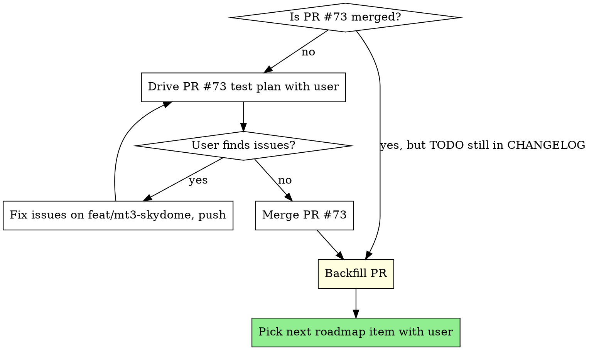

# Session Handoff — AloParticleEditor

**Last updated:** 2026-05-15
**Last conversation context:** MT-3 implementation + ship via subagent-driven-development; MT-4 shipped earlier in the same session.

---

## Read first

If you are a fresh Claude session resuming this project: read in this order.

1. **This file** (top to bottom).
2. **[CLAUDE.md](../CLAUDE.md)** — project conventions, plan structure, handoff discipline, the trust-but-verify rule. The authoritative behaviour spec.
3. **[ROADMAP.md](../ROADMAP.md)** — what's queued, what's shipped, the renumber rules.
4. **[CHANGELOG.md](../CHANGELOG.md)** — most-recent shipped work. Top entry is MT-3.
5. **Recent `git log`** — last ~20 commits to understand the rhythm.
6. Open PRs: `gh pr list --state open`.

Don't start touching code or writing plans until you've read all six.

---

## Resumable state (snapshot)

| Thing | Value |
|---|---|
| **Worktree** | `C:\Modding\Particle Editor\.claude\worktrees\serene-benz-b7d2af` |
| **Branch** | `feat/mt3-skydome` |
| **HEAD** | `ba19b1a` — `docs(MT-3): ship — CHANGELOG entry + ROADMAP renumber` |
| **Working tree** | clean |
| **Open PR** | **#73** — MT-3 selectable skydome backgrounds. **Not yet merged.** |
| **Upstream master** | last merged was MT-4 (PR #71) + its docs backfill (PR #72), merge commit `556dbf3`. |
| **Build status** | Debug + Release x64 clean (0/0). Verified after the most recent commit. |

Test plan for PR #73 is in the PR body on GitHub — the user (Anthony) drives the UI verification because the controller's screenshot/click tooling hit a multi-monitor / DPI-scaling wall during Task 10. The implementation has been spec-compliance- and code-quality-reviewed by independent subagents per task (see "How MT-3 was built" below).

---

## What to do first when resuming



### If PR #73 is unmerged

User drives the test plan (it's in the PR description). Key checks:

- **Camera-lock invariant**: orbit camera with a non-Off skydome → sphere stays "infinite", doesn't translate with camera.
- **Skydome contributes to bloom naturally** (intentional — same RT).
- **Slot 0 (Off)** reverts to flat `Background:` colour.
- **Custom slot file picker** filters `*.dds;*.tga` only (the two native EaW formats).
- **Reset View Settings** wipes `SkydomeIndex` but **preserves** `SkydomeCustomSlot{9,10,11}` paths (user data, not view settings — MT-2 convention).
- **Persistence** across editor restart.

If issues surface, fix on `feat/mt3-skydome`, push, drive again. Don't merge until clean.

### Merge protocol

Same as MT-4 (PR #71). Default to GitHub UI's "Merge pull request" button (regular merge commit, not squash, not rebase) so the per-task commit trail is preserved. Or:

```bash
gh pr merge 73 --merge --delete-branch=false
git fetch origin master
git log origin/master --oneline -1   # grab the merge-commit short hash
```

### Backfill protocol (mandatory after every feat: merge)

[`CHANGELOG.md`](../CHANGELOG.md) currently has `[`TODO`](.../commit/TODO)` placeholder in the MT-3 entry's date line. After merge:

```bash
git checkout -b docs/backfill-pr73 origin/master
# Edit CHANGELOG.md: replace both `TODO`s with the merge-commit short hash from step above
git add CHANGELOG.md
git commit -m "docs: backfill MT-3 ship — merge-commit hash for PR #73"
git push -u origin docs/backfill-pr73
gh pr create --title "docs: backfill MT-3 ship — merge-commit hash for PR #73" --body "..."
gh pr merge <number> --merge --delete-branch=false
```

This pattern was established by PR #70 (MT-1 backfill) and PR #72 (MT-4 backfill). Always a separate small PR, never folded into the feature PR — keeps the feature PR's hash stable.

---

## What's next on the roadmap

After MT-3 merges, **medium-term is empty for the first time** — every MT-N has shipped. The remaining queue:

- **Near term (§1)**: empty.
- **Medium term (§2)**: empty.
- **Long term (§3)**:
  - **LT-1** Programmable spawner v2 (~5–9 h, ★★★) — polish items deferred from v1: arc paths, velocity shorthand, path visualisation, named presets, clear-active-spawns button.
  - **LT-2** Template particle systems (~6–10 h, ★★★) — curated starter `.alo` files + *File → New from Template…*. Most effort is curating the templates.
  - **LT-3** Import emitters from other particle files (~8–14 h, ★★★★) — *File → Import Emitters from File…* with a tree-of-emitters picker and spawn-field re-mapping.
  - **LT-4** UI overhaul (WebView2 + React chrome) — huge undertaking. Mockup in Claude Designer, full rewrite of the chrome layer, JS↔C++ bridge. Don't tackle without explicit user direction.

Pick next with the user; don't just dive into LT-1. The natural conversation opener after the MT-3 dust settles: *"Medium-term tier is empty. Want to take a long-term item or do a polish pass? LT-1 is the smallest — about 5–9 h."*

---

## Conversation context the new session needs

### Project at a glance

- **AloParticleEditor**: Win32 + D3D9 + C++ tool for editing Star Wars: Empire at War / Forces of Corruption's `.alo` particle-effect format. Modernisation of an originally Petroglyph-internal tool.
- **Codebase shape**: huge `src/main.cpp` (~7000+ LOC, owns all UI), `src/engine.cpp/.h` (the D3D9 render layer), `src/UI/` for custom controls (Spinner, ColorButton, TexturePalette, etc.), `src/Resources/` for `.rc` + `.h` resource files (split by locale: `.en.h` and `.de.h`).
- **Game engine for Star Wars: EaW** ships as a 64-bit binary today (Petroglyph released an official patch ~2023+). Treat that as canonical, not a community fork.
- **Build**: `MSBuild.exe ParticleEditor.sln -p:Configuration=Debug -p:Platform=x64`. Use the `.sln` not the `.vcxproj` directly — `$(SolutionDir)` resolves from the sln.
- **User's editor**: DrKnickers (GitHub handle). Direct, technically rigorous, welcomes pushback. Release-notes voice: matter-of-fact, no "Dev note" callouts, no glib closer lines.
- **DirectX runtime**: release zips bundle `d3dx9_43.dll` next to the .exe; install instructions never ask users to install the DirectX runtime separately.

### Recently-shipped work that informs ongoing decisions

- **MT-1** (PR #69): Frequently-used textures palette popup. Modeless, sticky, multi-pin. Per-mod state in `%APPDATA%\AloParticleEditor\texture-palettes.ini`. **Visual-style baseline** for thumbnail grids.
- **MT-2** (PR #67): Selectable ground texture picker. Modeless, single-commit, click-to-select. **Interaction-model baseline** for slot pickers (MT-3 cloned this exactly).
- **MT-4** (PR #71): Adjustable environment lighting dialog. Established the **modeless tool-window** chrome (`WS_EX_TOOLWINDOW | WS_POPUPWINDOW | WS_CAPTION | WS_SYSMENU`) shared by MT-1/MT-2/MT-3/Bloom/Lighting. Also discovered and fixed the **Win11 disabled-EDIT-text-invisible quirk** (see "Hard-won lessons" below).
- **MT-3** (PR #73, this session): Selectable skydome picker. Combines MT-1's visual style with MT-2's interaction model.

---

## Hard-won lessons (preserve!)

These bit us in the recent sessions; preserve them so the next session doesn't rediscover at cost.

### Win11 themed-control quirks (from MT-4)

**Symptom**: `EnableWindow(hSpinner, FALSE)` makes the spinner's inner EDIT render with no text — not just greyed-out, *invisible*. Win11 default theme actively suppresses text drawing on disabled EDITs.

**Failed fixes**:
- Return a brush from `WM_CTLCOLORSTATIC` — fires but text still invisible.
- Return a brush from `WM_CTLCOLOREDIT` for an ES_READONLY edit — also breaks text rendering.

**Working fix** (lives at [`src/UI/Spinner.cpp:115`](../src/UI/Spinner.cpp:115) in `SpinnerEditWindowProc`'s WM_PAINT branch): subclass the EDIT's `WM_PAINT` and draw text manually with `DrawText` + `FillRect`. Bypasses the themed-control paint path entirely. Triggered by a new `Spinner_SetReadOnly(HWND, bool)` API + matching `Spinner_IsReadOnly` getter.

Pattern to remember: **on Win11, if a themed common control "should" display text but doesn't, subclass `WM_PAINT` and own the rendering.** Don't rely on `WM_CTLCOLOR*` overrides — they're advisory at best, ignored at worst.

### `wcx.hIcon` clobbered between two `RegisterClassEx` calls (from MT-4)

`InitializeWindows` registers two window classes from the same `WNDCLASSEX` struct: the main window class (which wants the IDI_LOGO icon) and the renderer child class (which doesn't). Between the two `RegisterClassEx` calls, `wcx.hIcon` gets reset to NULL. Any code reading `wcx.hIcon` *after* that reset gets NULL.

**Fix**: cache HICONs in `hIconBig` / `hIconSmall` locals *before* the renderer-class registration, then pass those locals to `WM_SETICON` and `SetClassLongPtr(GCLP_HICON / GCLP_HICONSM)` after `CreateWindow`. Plus `SetCurrentProcessExplicitAppUserModelID(L"DrKnickers.AloParticleEditor")` (loaded dynamically out of shell32 because the project's `_WIN32_WINNT = 0x0501` predates that API) for a stable taskbar identity that doesn't cache off the .exe path.

### Bundled-asset format: DDS vs TGA trade-off (from MT-3)

**Plan said**: BC1 (DXT1) compressed DDS for bundled skydome textures — matches game-engine native compression, ~256 KB per file.

**Reality**: Pillow's BC1 DDS write path requires external tooling (`texconv.exe` from DirectXTex, or `wand`/ImageMagick). Neither is guaranteed on the dev box. The procedural placeholder generator can't reliably ship BC1.

**Resolution**: v1 ships 24-bit RGB TGA placeholders via Pillow's native TGA writer (~1.5 MB per file, ~12 MB total bundle). The engine loader (`D3DXCreateTextureFromFileInMemory`) handles both formats identically, so curated BC1 DDS assets are a content-only follow-up that doesn't touch any code.

**Convention to remember**: when bundling assets via `RCDATA`, prefer formats Pillow can write natively (`.tga`, `.png`, `.bmp`) unless an asset pipeline with `texconv` is already established. Document the size trade-off if the bundle grows past ~10 MB.

### `D3DXCreateEffect` failures are silent without an error buffer (from MT-3)

The `LPD3DXBUFFER* ppErrors` out-parameter on `D3DXCreateEffect` is the ONLY way to see why a shader compile failed. The HRESULT alone tells you "it failed" but not why. **Always pass a non-NULL `pErrors` and surface it under `#ifndef NDEBUG`** — see `Engine::InitSkydomeEffect` for the pattern.

### `HRESULT`s from D3D9 init calls (from MT-3 Task 1 review)

The engine's existing constructor pattern: `if (FAILED(...)) throw runtime_error("Unable to create ...")`. New init code must honour this contract. A `Create*` failure followed by an unguarded `Lock()` is a guaranteed null-deref. **All `m_pDevice->Create*` and `pBuffer->Lock` calls at init time must be FAILED-guarded.**

### Sphere geometry: triangle count math (from MT-3 Task 1)

For a UV sphere with `lon` longitude × `lat` latitude segments:
- Quads = `lon × lat`
- Triangles = `lon × lat × 2`  ← off-by-2× from the quad count
- Vertices = `(lon + 1) × (lat + 1)`  ← seam duplication

If `lon=32, lat=16`: 561 vertices, 1024 triangles. The MT-3 plan typo'd it as `tris=512`; the code at `Engine::InitSkydomeMesh` is correct.

### ROADMAP renumber discipline (always applies)

- **`[TIER-K]` tags (NT-3, MT-5, LT-1) are permanent.** Never reused, never renamed, even if the item moves between tiers (which is rare).
- **`N.M` positions are transient.** They renumber freely when items ship.
- **When an item ships**: strikethrough title, append `✅ Shipped (#NN)`, add `**Actual:**` line, move entry to top of §5 Shipped (position 5.1), shift all other §5 entries down by 1, close the source-tier gap by renumbering remaining items in that tier.
- **Renumber bottom-up** so each `### N.M ` pattern is unique-findable at the moment of its Edit call. Top-down causes collisions.

### Subagent-driven development workflow

The `superpowers:subagent-driven-development` skill works well for tasks with:
- Clean plan with code-quoted source.
- Mechanical-to-medium complexity per task.
- Existing-pattern analogs in the codebase (e.g. MT-2's ground picker as model for MT-3's skydome picker).

Per-task: dispatch implementer → dispatch spec reviewer → if compliant, dispatch code-quality reviewer → if approved, mark task done. Fix loops where reviewers flag Important issues; dispatch a focused fix subagent.

**Model selection**: cheap (haiku) for mechanical tasks (RC files, resource IDs, registry helpers); standard (sonnet) for multi-file integration with judgement (engine state, render pass, dialog procs); most capable (opus) for true architecture/design — but in practice almost everything in this codebase fits sonnet.

**Per-task PR-style review** catches real bugs early. MT-3 fix loops caught: missing HRESULT checks, magic-number array size, unused variable, RCDATA comment correctness, off-by-2× triangle count typo. None were show-stoppers, but all were worth fixing before merging.

### CLAUDE.md plan-location vs writing-plans skill default

The `superpowers:writing-plans` skill defaults to `docs/superpowers/specs/YYYY-MM-DD-<topic>-design.md`. **The project's `CLAUDE.md` overrides this** and routes plans to `tasks/todo.md`. Per the priority hierarchy (user instructions > skills > defaults), `tasks/todo.md` wins. Don't accidentally create `docs/superpowers/` subdirs.

After a plan ships, `tasks/todo.md` is *not* archived — it gets overwritten by the next plan. The shipped work lives in CHANGELOG / ROADMAP / commit history, which is enough.

### Pre-handoff testing discipline (from MT-1, codified in CLAUDE.md)

Before saying "take a look" / "let me know what you see" to the user:

1. Build the binary yourself (clean compile is the floor).
2. Mentally walk every code path: branches, edge cases (empty input, missing file, first-run state, mod-switch mid-action).
3. Verify rendered geometry: compute pixel positions yourself; match against what the user will see.
4. Static-analyse for Win32 canonical failure modes: `WS_CLIPSIBLINGS` / `WS_CLIPCHILDREN`, sibling z-order, font defaults, message routing through subclasses, stale HWND handles.
5. Smoke-run the binary if you can — even a cold launch catches startup crashes.
6. Document the test pass in the handoff message: what you tested, what you fixed, what you couldn't verify.

The user's time is much more expensive than yours. One round-trip "boot the editor, hit the obvious problem, report back" costs more than any amount of pre-handoff static review.

### Backup / archive convention

- **`tasks/todo.md`**: current/active plan. Overwritten when a new plan begins.
- **`tasks/HANDOFF.md`** (this file): session-resumption notes. Update it when a session ends with significant in-flight context. Commit it to the working branch.
- **`tasks/lessons.md`**: persistent corrections from user feedback. Per CLAUDE.md: "After any correction the user makes, update `tasks/lessons.md` with a rule that prevents the same mistake."
- **`CHANGELOG.md`**: shipped feature history. Top entry is most recent.
- **`ROADMAP.md`**: queued + shipped roadmap items with tier tags.

---

## File-level breadcrumbs

If you need to find specific patterns quickly:

| Need | Where to look |
|---|---|
| Modeless tool-window chrome | `ShowGroundTexturePicker` / `ShowSkydomePicker` / `ToggleBloomDialog` / `ToggleLightingDialog` in [`src/main.cpp`](../src/main.cpp) |
| Owner-drawn 24×24 toolbar preview button | `WM_DRAWITEM` handler in main wndproc, branches on `dis->CtlID == hGroundTexturePreview` / `ID_SKYDOME_PREVIEW` |
| Thumbnail generation via D3D9 → DIB | `MakeGroundSlotThumbnail` and `MakeSkydomeSlotThumbnail` |
| Custom-paint ListView (escape native selection chrome) | `GroundLVSubclassProc` and `SkydomeLVSubclassProc` |
| Registry helpers (DWORD / float / REG_SZ / RECT) | Around `Read/WriteBloomFloat`, `Read/WriteSkydomeIndex` |
| Reset View Settings handler | Around [`src/main.cpp:1593`](../src/main.cpp:1593), `case ID_VIEW_RESET_VIEW_SETTINGS` |
| Render-pipeline structure | `Engine::Render` in [`src/engine.cpp`](../src/engine.cpp), starting around line 492 |
| FX shader file format | [`src/Resources/Engine/Skydome.fx`](../src/Resources/Engine/Skydome.fx) — minimal D3DX9 effect, vs_2_0/ps_2_0 |
| Dialog template patterns | [`src/ParticleEditor.en.rc`](../src/ParticleEditor.en.rc) (and `.de.rc`) — `IDD_*` blocks |
| Resource ID conventions | [`src/Resources/resource.h`](../src/Resources/resource.h) (locale-agnostic — `IDR_*`, `IDB_*`), `resource.en.h` / `resource.de.h` (locale-specific — `IDD_*`, `IDC_*`, `IDS_*`) |

---

## Open questions / deferrals (do *not* silently address)

- **MT-3 bundle size**: 12 MB of placeholder TGA. Acceptable for v1 ship. If user complains post-merge, the follow-up is curated BC1 DDS at ~2 MB total. Don't pre-emptively optimise.
- **Skydome → bloom interaction**: bright skies (Space) on Bloom can blow out particles. Currently acceptable; if user reports, add a "skydome contributes to bloom" toggle in a follow-up. Don't add speculatively.
- **Cubemap (6-face) skydomes**: out of scope for MT-3. Equirectangular 2D is simpler to source/load/thumbnail and meets the use case. If anyone asks, it's a follow-up that adds a second loader path.
- **Skydome → directional-light coupling** (e.g. Sunset auto-shifts the sun direction): explicitly out of scope. MT-4's lighting panel is the manual coupling surface.
- **Picker dialog text in German**: `.de.rc` mirrors `.en.rc` structure with English placeholder strings, consistent with project convention (German translation perennially lags English). Don't translate without explicit user direction.

---

## Authoritative pointers

- **Commit log** (recent): `git log --oneline -20`
- **PR list**: `gh pr list --state all --limit 10`
- **Build command**: `"/c/Program Files/Microsoft Visual Studio/18/Community/MSBuild/Current/Bin/MSBuild.exe" "ParticleEditor.sln" -p:Configuration=Debug -p:Platform=x64 -nologo -clp:Summary 2>&1 | tail -5`
- **Smoke launch**: `cd "<worktree>" && start "" "./x64/Debug/ParticleEditor.exe"` then `Get-Process -Name "ParticleEditor"` to confirm alive.
